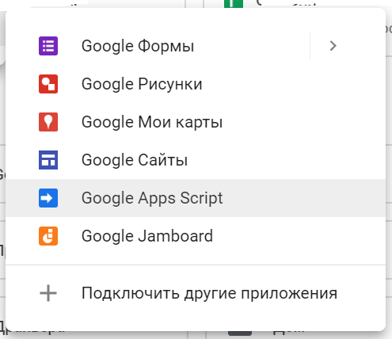

###### Google Scripts Samples

This repo is a fork of https://github.com/empenoso/Google-Apps-Script.
_____________

**Scripts in the repo**:
  * _scripts/calendar/Age of your contacts.gs_ - scans your Google Contacts list and for 
those contacts which have date of birthday specified creates new event in your Google Calendar.
How to use:

    a. [Create new calendar](https://calendar.google.com/calendar/r/settings/createcalendar?tab=mc1).
In our case it's _Autogen birthdays_ (once it's created you can configure this calendar default settings like notifications) 

    b. Install Google Apps Script (if not done yet) 

    c. Create script in Google Docs and paste the content of _scripts/calendar/Age of your contacts.gs_ into it.
    
    d. Save the script and run _contactAge2Calendar_ function.
     
    e. Google will request to grant rights for your application (for Google Calendar, Contacts and GMail).
    
    f. Confirm and run _scheduleNextAppLaunch_. Every Sunday night the script will automatically scan your contacts and update your calendar.

_____________

Ilya Avdeev
